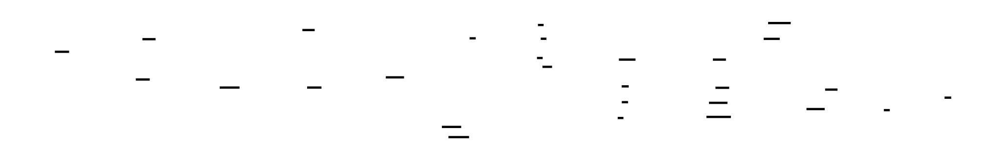

# /committee — Kanban Multi-Model Reasoning Committee

Launch a Kanban Committee that fans a research goal out to specialized worker profiles in parallel, gates the outputs through a reviewer, synthesizes a final report, and auto-delivers it back to the originating thread.

Use this instead of the old `kanban-swarm` or `answer-panel` workflows. This skill is the canonical home for the Kanban-style committee runner, presets, source-traceability rules, Librarian context feeding, and KOS curation nomination protocol.

## Usage

```
/committee <your question>
```

The text after `/committee` is the research goal. Be specific: it becomes the prompt for the Librarian context pass, every worker lane, the reviewer, and the synthesizer.

## Execution

When invoked, immediately run this command. Do **not** plan or ask for confirmation — launch the committee directly:

```bash
/Users/ambler/.hermes/hermes-agent/venv/bin/python \
  ~/agent-skills/skills/autonomous-ai-agents/committee/scripts/committee.py \
  --preset committee_default \
  --json \
  "<GOAL>"
```

Replace `<GOAL>` with the user's question. Escape embedded quotes as needed.

After launch, report the task IDs and worker assignments back to the user. Do **not** wait for completion — the synthesis will auto-deliver when done.

## What Happens

1. **Root card / blackboard** is created as the shared audit anchor.
2. **Librarian context compilation** runs first and writes `kos_context.md` into the persistent committee workspace.
3. **Workers run in parallel** using the selected preset.
4. **Reviewer** waits for all workers, checks contradictions/hallucinations, performs source credibility audit, and gates the swarm.
5. **Analyst/Synthesizer** waits for reviewer pass and creates the final report with a source-traceability appendix.
6. **Auto-delivery** posts the final report back to the originating thread via `hermes kanban notify-subscribe`.

Expected wall time: roughly 8–12 minutes for the default roster, depending on worker latency and research depth. Expected cost: roughly $0.50–$1.00, model-dependent.

## Architecture Diagram

The flow of roles, artifacts, and source/claim provenance through the committee is mapped out from initiation to final synthesis and KOS curation:

- [D2 Source Diagram](references/committee-provenance-pipeline.d2)
- [SVG Rendered Diagram](references/committee-provenance-pipeline.svg)



## Default Worker Roster

The default preset uses 6 parallel workers at medium reasoning:

- `worker-cheap1` — GLM-5.2; consistently top-scored analytical model.
- `worker-cheap3` — MiniMax-M3; framework innovator, surfaces novel angles.
- `worker-cheap4` — DeepSeek-V4-Pro; quantitative depth.
- `worker-frontier1-librarian` — Gemini-3.5-flash-medium; Librarian-informed context compiler + research lane.
- `worker-frontier2` — GPT-5.5-medium; sourcing, detail mapping, citation rigor.
- `worker-frontier4` — Grok-4.3; adversarial/frontier reasoning.

## Preset Configuration

Committee presets live beside the runner:

```text
~/agent-skills/skills/autonomous-ai-agents/committee/scripts/presets.json
```

Primary presets:

- `committee_default` — preferred default mix of cheap + frontier/librarian lanes.
- `committee_frontier` — frontier/librarian lanes only.
- `committee_cheap` — budget workers only.
- `committee_all` — all active frontier/librarian + cheap workers.
- `committee_definitive_power` — frontier/librarian lanes plus strongest budget workers.

To use a non-default preset manually:

```bash
/Users/ambler/.hermes/hermes-agent/venv/bin/python \
  ~/agent-skills/skills/autonomous-ai-agents/committee/scripts/committee.py \
  --preset committee_definitive_power \
  --json \
  "<GOAL>"
```

You can also override workers directly:

```bash
/Users/ambler/.hermes/hermes-agent/venv/bin/python \
  ~/agent-skills/skills/autonomous-ai-agents/committee/scripts/committee.py \
  --workers worker-cheap1,worker-frontier2,worker-frontier4 \
  --json \
  "<GOAL>"
```

## Runtime Model Overrides

The runner supports database-level runtime model overrides:

```bash
/Users/ambler/.hermes/hermes-agent/venv/bin/python \
  ~/agent-skills/skills/autonomous-ai-agents/committee/scripts/committee.py \
  --preset committee_frontier \
  --model-overrides "worker-frontier2:cx/gpt-5.5-high,worker-frontier1-librarian:agy/gemini-3.5-flash-high" \
  --json \
  "<GOAL>"
```

Guidance:

- Default to `medium` reasoning for cost/speed unless the question is unusually complex.
- Use `high`/`xhigh` selectively for synthesis-critical or adversarial lanes.
- Worker profiles should generally support `${REASONING_LEVEL:-medium}` in profile config so runtime overrides remain ergonomic.

## Source Traceability Protocol

For research/investment committees, source tracing is mandatory. The final synthesis must not become a meta-analysis of unsourced worker prose.

### Worker Traceability Deliverables

Each worker must write a markdown report containing:

- `## Source Ledger`: Source ID, Type, Title/Name, URL or local path, Date/Access date, Why used, Credibility notes, and `KOS candidate? (Y/N/Maybe)`.
- `## Claim Register`: Claim ID, Claim, Source IDs, Confidence, and Notes/Caveats.
- `## KOS Candidate Sources`: Source ID, Proposed destination/domain, Ingestion rationale, and Review caveats for worker-discovered sources worth possible durable ingestion.
- Stable source/claim IDs prefixed with worker name, e.g. `worker-frontier2-S01`, `worker-frontier2-C03`.
- Factual claims, market-size figures, ticker mappings, replacement claims, catalysts, and timelines must cite Source IDs.
- Separate fact from inference: cite facts directly, label inference, and cite the facts the inference depends on.
- Include skepticism for low-credibility sources such as promotional IR, stale articles, unsourced web summaries, or model-memory claims.
- If using `kos_context.md`, cite the original KOS path/section where visible; if provenance is incomplete, mark it `KOS excerpt — provenance incomplete`.
- Do **not** ingest new sources into KOS during task execution unless explicitly instructed; nominate candidates for later curation.

### Reviewer Credibility Audit Deliverables

The reviewer must produce:

- `## Source Credibility Audit`: Source ID, Worker, Primary/secondary, Timeliness, Directness, Credibility verdict, Carry forward? (Y/N), and Notes.
- `## Unsupported or Weakly Supported Claims`: Claim ID, Claim, Problem, and Required fix.
- `## KOS Ingestion Candidates`: Source ID, Worker, Proposed KOS destination/domain, Ingestion priority (`High`/`Medium`/`Low`/`Reject`), Reason, and Caveats.
- Verification that source paths or URLs are recoverable.
- A block if key claims lack source IDs, rely on unvetted model memory, or use missing/non-recoverable links.

The reviewer must **not** ingest sources into KOS during verification. It should classify candidates for a later Librarian/curation pass.

### Synthesizer Carry-Through Deliverables

The final synthesis must contain:

- Inline citations using Source IDs, e.g. `[worker-frontier2-S01]`, for material factual points, numbers, and catalysts.
- `## References / Source Traceability` table representing: Final claim, Worker claim IDs, Source IDs, Original references.
- No new material factual claims without source IDs and references.
- No claims marked by the reviewer as failed/unsupported unless explicitly framed as disputed.

## Living Evidence Artifacts

`source_manifest.md` and `evidence_pack.md`, when present in the workspace, are living evidence ledgers:

1. Librarian seeds canonical context/evidence files.
2. Workers add worker-scoped deltas or clearly partitioned sections instead of racing to overwrite canonical files.
3. Reviewer deduplicates, audits credibility, and decides what carries forward.
4. Synthesizer uses only vetted evidence and preserves source IDs/references.

Avoid concurrent direct overwrites of shared canonical evidence files. Prefer append-only worker deltas followed by reviewer merge/audit.

## KOS Curation Gate

Worker-discovered sources should be surfaced now but ingested later:

1. Workers nominate via `KOS candidate? (Y/N/Maybe)` and `## KOS Candidate Sources`.
2. Reviewer classifies in `## KOS Ingestion Candidates` with priority and caveats.
3. Librarian/curator ingests in a separate curation pass after the committee completes.

This prevents KOS pollution while preserving important new sources for durable knowledge capture.

## Worker Profile Management

Worker profiles live under:

```text
/Users/ambler/.hermes/profiles/
```

Current convention:

- `worker-frontier1-librarian` — Gemini/librarian-capable worker lane.
- `worker-frontier2` — GPT-5.5 frontier worker lane.
- `worker-frontier4` — Grok frontier/adversarial lane.
- `worker-cheap1`, `worker-cheap3`, `worker-cheap4` — budget/diverse analytical lanes.

When creating or renaming worker profiles:

1. Create/rename the profile directory under `/Users/ambler/.hermes/profiles/`.
2. Ensure profile `config.yaml` points at the intended provider/model and reasoning defaults.
3. Copy required `.env` / `.env.mapping` material where needed, but never commit credentials.
4. Update `committee/scripts/presets.json`.
5. Run a dry committee launch or syntax/import check before relying on the new roster.

## Persistent Workspace Lifecycle

The committee runner uses persistent directory workspaces under:

```text
~/.hermes/kanban/workspaces/t_<root_id>/
```

This is intentional: worker reports, `kos_context.md`, source manifests, evidence packs, verifier output, and synthesis artifacts should survive task completion. Older scratch-workspace patterns could lose outputs after cards reached `done`.

## Post-Run Observability

After a run, useful checks include:

- Inspect `~/.hermes/kanban/workspaces/t_<root_id>/` for `kos_context.md`, `report*.md`, `evidence_pack.md`, `source_manifest.md`, reviewer output, and synthesis.
- Compare worker outputs for recurring errors or missing source IDs.
- Look for fallback/model override evidence in task metadata or worker session logs if output quality looks off.
- Review token/cost if evaluating model roster efficiency.
- Archive high-value final memos into Obsidian under the appropriate Knowledge OS destination.

## Pitfalls

- **Do not only post to blackboard.** Workers must save markdown artifacts in the shared workspace.
- **Grok/xAI lanes may blackboard-only by default** unless the prompt explicitly requires file output.
- **Do not flatten provenance.** Synthesizer must preserve source IDs and original references.
- **Do not auto-ingest into KOS.** Nominate now, curate later.
- **Avoid stale profile names.** `worker-frontier1` is no longer the default GPT-5.5 lane; use `worker-frontier2` and `worker-frontier1-librarian` per current convention.
- **Missing `.env` / profile config breaks workers silently or causes fallback.** Verify profile directories after renames.
- **Avoid over-engineered recovery scripts.** If outputs exist in the persistent workspace, read the markdown files directly.

## Migration Note

This skill absorbs the useful Kanban-swarm and answer-panel committee machinery. The old standalone `kanban-swarm` and `answer-panel` skills were historical predecessors; committee is now the single active skill for multi-worker Kanban research committees.
