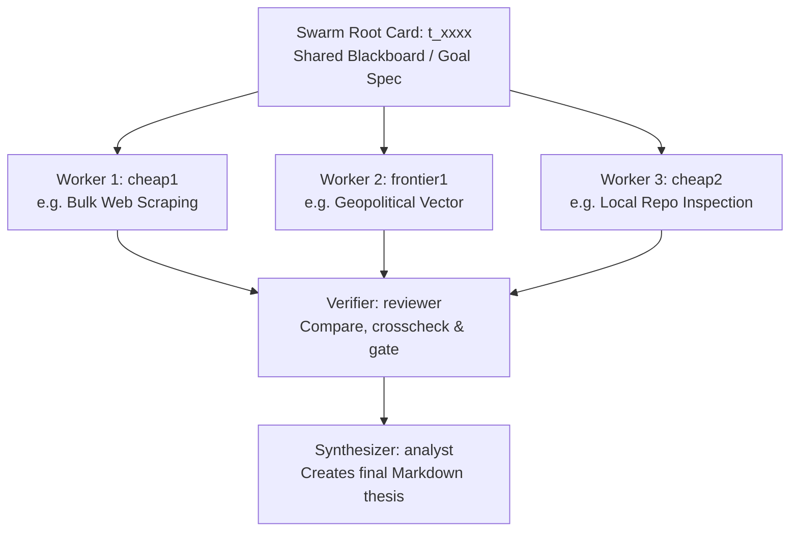

# Kanban Swarm Design Pattern

The Kanban Swarm pattern resolves complex research, code refactoring, or analytical goals by decomposing work into a directed acyclic graph (DAG) of parallel agent workers, a verifier, and a synthesizer. It uses the Hermes Kanban database to handle asynchronous scheduling and variable model response times natively.

## Why Use Kanban Swarms?

1. **Varying Response Times**: Highly logical reasoning models (e.g., DeepSeek R1, GPT-5.5-high/xhigh) can take minutes to compute. In a synchronous inline API setup, this causes client timeouts. In a Kanban Swarm, each worker runs as an independent background process.
2. **Active Tool Use**: Unlike a text-only API completion panel, swarm workers have full capabilities (terminal execution, web searches, file edits, code runs) within their isolated workspace environments.
3. **Structured Handoff Gating**: Downstream verifier (`reviewer`) and synthesizer (`analyst`) tasks are held in `blocked` or `todo` state by the gateway dispatcher until all parent worker nodes transition to `done`.
4. **Integrated Delivery**: The final synthesizer task automatically posts its completed Markdown report back into the originating platform conversation thread (Discord/Telegram) using the gateway notifier.

---

## Swarm Topology (Worker/Verifier/Synthesizer DAG)



1. **Root Card** (`t_root`): Holds the master prompt/question. Serves as a shared blackboard using the card comments stream. It transitions to `done` immediately upon launch.
2. **Workers** (Parallel, depend on Root): Execute concurrently under their assigned profile directories (`workspace_kind="scratch"` or `"dir"`).
3. **Verifier** (Gatekeeper, depends on all Workers): Claims task only when all workers are `done`. Evaluates findings for contradictions, accuracy, and completeness. Blocks the swarm if evidence is insufficient (`kanban_block()`), or completes to trigger the synthesizer.
4. **Synthesizer** (Judge, depends on Verifier): Compiles the final report, outputs the Markdown thesis, and marks the campaign complete.

---

## Profile Construction & Specialization

To execute a swarm, you map workers to dedicated Hermes profiles. This guarantees model diversity, reasoning levels, and custom tool authorizations.

### Creating a Swarm Profile
Copy a template or base profile to set up your worker:
```bash
cp -r ~/.hermes/profiles/_template ~/.hermes/profiles/my-swarm-worker
```

### Config.yaml Specifications
Every specialist worker profile must define its connection routing, fallbacks, toolsets, and reasoning effort:

```yaml
# ~/.hermes/profiles/my-swarm-worker/config.yaml
model:
  default: cx/gpt-5.5-medium    # Primary model (e.g., medium reasoning)
  provider: omniroute

fallback_providers:
  - model: openai/gpt-5.5
    provider: nous
  - model: openai/gpt-5.5
    provider: openrouter

providers:
  omniroute:
    base_url: ${OMNIROUTE_URL}/v1
    api_key: ${OMNIROUTE_API_KEY}

approvals:
  mode: auto                    # Allows autonomous background execution

toolsets:
  - terminal
  - file
  - web
  - browser
  - kanban
  - code_execution

agent:
  max_turns: 120
  gateway_timeout: 1800
  reasoning_effort: medium     # Match thinking budget to task type
```

### Context Window Strategy
* **Cheap Workers (`cheap1/2/3`)**: Target models with massive context windows (e.g. Gemini 3.5 Flash, Qwen 2.5/3.6 Flash) to ingest bulk raw scrapings, regulatory filings, or large code files cheaply.
* **Frontier Workers (`frontier1/2/3`)**: Target thinking/reasoning models (e.g. GPT-5.5, Claude Fable/Opus). Provide them with pre-filtered summaries to avoid expensive token consumption.

---

## Launching a Swarm Programmatically (Python)

A swarm launcher script builds the task graph in the SQLite database and binds the active platform delivery context.

```python
import os
import subprocess
import sqlite3
from hermes_cli import kanban_db as kb
from hermes_cli import kanban_swarm as ks
from hermes_cli.kanban_swarm import SwarmWorkerSpec

def launch_swarm(goal: str, worker_profiles: list, verifier: str, synthesizer: str):
    # Connect to local Kanban Database
    conn = kb.connect()
    
    # 1. Define Worker specs
    workers = []
    for profile in worker_profiles:
        workers.append(SwarmWorkerSpec(
            profile=profile,
            title=f"Worker ({profile}) analysis for {goal[:50]}...",
            body=f"Assess this goal from your specialty lens:\n\n{goal}",
            skills=[]
        ))
        
    # 2. Build the DAG in SQLite
    swarm = ks.create_swarm(
        conn=conn,
        goal=goal,
        workers=workers,
        verifier_assignee=verifier,
        synthesizer_assignee=synthesizer,
        root_title=f"Swarm: {goal[:50]}..."
    )
    
    # 3. Bind Platform Delivery
    # Retain active Discord/Telegram thread environment variables
    platform = os.environ.get("HERMES_SESSION_PLATFORM")
    chat_id = os.environ.get("HERMES_SESSION_CHAT_ID")
    thread_id = os.environ.get("HERMES_SESSION_THREAD_ID")
    
    if platform and chat_id:
        cmd = [
            "/Users/ambler/.hermes/hermes-agent/venv/bin/hermes",
            "kanban", "notify-subscribe",
            swarm.synthesizer_id,
            "--platform", platform,
            "--chat-id", chat_id
        ]
        if thread_id:
            cmd.extend(["--thread-id", thread_id])
            
        subprocess.run(cmd, check=True)
```

---

## Verification & Monitoring

1. **Audit Graph Insertion**:
   Ensure all tasks were written correctly:
   ```bash
   hermes kanban list --status ready
   ```
2. **Inspect Context Pipeline**:
   Verify what a worker sees when claiming a task (including sibling/parent comments and results):
   ```bash
   hermes kanban show <task_id>
   ```
3. **Gateway Logs**:
   Monitor the dispatcher ticks to ensure workers promote and execute cleanly:
   ```bash
   tail -f ~/.hermes/logs/gateway.log
   ```

---

## Pitfalls & Best Practices

* **Missing `.env` files**: New profiles must have `.env` and `.env.mapping` files copied from a working profile to resolve base urls and api keys.
* **Infinite Loops**: Ensure all background workers end their sessions by calling `kanban_complete()` or `kanban_block()`. Stale worker tasks block downstream verifiers.
* **Blackboard updates**: Instruct your workers to write intermediate notes as comments to the root task (`root_id`), allowing them to feed coordinates/conclusions into a shared thread.
