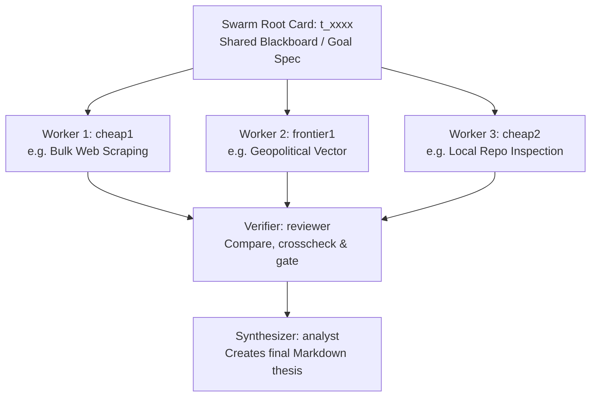

# Kanban Swarm Design Pattern

The Kanban Swarm pattern resolves complex research, code refactoring, or analytical goals by decomposing work into a directed acyclic graph (DAG) of parallel agent workers, a verifier, and a synthesizer. It uses the Hermes Kanban database to handle asynchronous scheduling and variable model response times natively.

## Why Use Kanban Swarms?

1. **Varying Response Times**: Highly logical reasoning models (e.g., DeepSeek R1, GPT-5.5-high/xhigh) can take minutes to compute. In a synchronous inline API setup, this causes client timeouts. In a Kanban Swarm, each worker runs as an independent background process.
2. **Active Tool Use**: Unlike a text-only API completion panel, swarm workers have full capabilities (terminal execution, web searches, file edits, code runs) within their isolated workspace environments.
3. **Structured Handoff Gating**: Downstream verifier (`reviewer`) and synthesizer (`analyst`) tasks are held in `blocked` or `todo` state by the gateway dispatcher until all parent worker nodes transition to `done`.
4. **Integrated Delivery**: The final synthesizer task automatically posts its completed Markdown report back into the originating platform conversation thread (Discord/Telegram) using the gateway notifier.

---

## Swarm Topology (Worker/Verifier/Synthesizer DAG)



1. **Root Card** (`t_root`): Holds the master prompt/question. Serves as a shared blackboard using the card comments stream. It transitions to `done` immediately upon launch.
2. **Workers** (Parallel, depend on Root): Execute concurrently under their assigned profile directories (`workspace_kind="scratch"` or `"dir"`).
3. **Verifier** (Gatekeeper, depends on all Workers): Claims task only when all workers are `done`. Evaluates findings for contradictions, accuracy, and completeness. Blocks the swarm if evidence is insufficient (`kanban_block()`), or completes to trigger the synthesizer.
4. **Synthesizer** (Judge, depends on Verifier): Compiles the final report, outputs the Markdown thesis, and marks the campaign complete.

---

## Profile Construction & Specialization

To execute a swarm, you map workers to dedicated Hermes profiles. This guarantees model diversity, reasoning levels, and custom tool authorizations.

### Creating a Swarm Profile

To add a new model to the swarm (e.g., `worker-frontier4` for Grok-4.3):

```bash
# 1. Create the profile directory
mkdir -p ~/.hermes/profiles/worker-<name>/

# 2. Write config.yaml with the model, provider, fallbacks, and toolsets
#    (see template below)

# 3. Copy credential files from a working profile
cp ~/.hermes/profiles/worker-frontier1/.env ~/.hermes/profiles/worker-<name>/.env
cp ~/.hermes/profiles/worker-frontier1/.env.mapping ~/.hermes/profiles/worker-<name>/.env.mapping

# 4. Verify the profile works
hermes --profile worker-<name> chat -q "hello, what model are you? reply in 10 words or less"

# 5. Add to presets.json
```

**Note:** Non-omniroute providers (e.g., `grok-oauth` for Grok-4.3) inherit global config from `~/.hermes/config.yaml`; only omniroute needs an explicit `providers:` block in profile config.

### Config.yaml Specifications

Every specialist worker profile must define its connection routing, fallbacks, toolsets, and reasoning effort:

```yaml
# ~/.hermes/profiles/my-swarm-worker/config.yaml
model:
  default: cx/gpt-5.5-medium    # Primary model (e.g., medium reasoning)
  provider: omniroute

fallback_providers:
  - model: openai/gpt-5.5
    provider: nous
  - model: openai/gpt-5.5
    provider: openrouter

providers:
  omniroute:
    base_url: ${OMNIROUTE_URL}/v1
    api_key: ${OMNIROUTE_API_KEY}

toolsets:
  - terminal
  - file
  - web
  - browser
  - kanban
  - code_execution            # "code_execution" is valid; "code_exec" is deprecated/invalid.

platform_toolsets:
  cli:
    - terminal
    - file
    - web
    - browser
    - kanban
    - code_execution

approvals:
  mode: auto

agent:
  max_turns: 120
  gateway_timeout: 1800
  reasoning_effort: ${REASONING_LEVEL:-medium}   # Allows runtime control via env var
```

### Context Window Strategy
* **Cheap Workers (`cheap1/2/3`)**: Target models with massive context windows (e.g. Gemini 3.5 Flash, Qwen 2.5/3.6 Flash) to ingest bulk raw scrapings, regulatory filings, or large code files cheaply.
* **Frontier Workers (`frontier1/2/3`)**: Target thinking/reasoning models (e.g. GPT-5.5, Claude Fable/Opus). Provide them with pre-filtered summaries to avoid expensive token consumption.

---

## Launching a Swarm

### Via CLI Script (Recommended)
```bash
# Use presets
~/agent-skills/skills/software-development/answer-panel/scripts/committee.py \
  --preset committee_frontier \
  "Evaluate the defensibility of ASML's EUV lithography moat"

# Custom workers + model overrides
~/agent-skills/skills/software-development/answer-panel/scripts/committee.py \
  --workers worker-frontier1,worker-frontier2,worker-frontier3,worker-frontier4 \
  --model-overrides "worker-frontier1:cx/gpt-5.5-high,worker-frontier2:agy/gemini-3.5-flash-high" \
  "Goal text"
```

Key flags: `--preset`, `--workers`, `--verifier`, `--synthesizer`, `--model-overrides`, `--json`.

Presets: `~/agent-skills/skills/software-development/answer-panel/scripts/presets.json`

### Via Python (Programmatic)
```python
import os, subprocess
from hermes_cli import kanban_db as kb
from hermes_cli import kanban_swarm as ks
from hermes_cli.kanban_swarm import SwarmWorkerSpec

conn = kb.connect()
workers = [SwarmWorkerSpec(profile="worker-frontier1", title="...", body="...", skills=[], priority=10)]
swarm = ks.create_swarm(conn=conn, goal="...", workers=workers, verifier_assignee="reviewer", synthesizer_assignee="analyst")

# Subscribe active channel to synthesizer for auto-delivery
platform = os.environ.get("HERMES_SESSION_PLATFORM")
chat_id = os.environ.get("HERMES_SESSION_CHAT_ID")
thread_id = os.environ.get("HERMES_SESSION_THREAD_ID")
if platform and chat_id:
    cmd = ["hermes", "kanban", "notify-subscribe", swarm.synthesizer_id, "--platform", platform, "--chat-id", chat_id]
    if thread_id: cmd.extend(["--thread-id", thread_id])
    subprocess.run(cmd, check=True)
```

---

## Runtime Model Overrides

The `tasks.model_override` column enables per-task model changes without editing profiles:
- **Full model slug** (e.g., `cx/gpt-5.5-high`) — passed as `-m` flag to spawned CLI
- **Reasoning keyword** (`low`/`medium`/`high`/`xhigh`) — injected as `REASONING_LEVEL` env var

Dispatcher logic in `kanban_db.py:_default_spawn()`:
```python
if task.model_override in ("low", "medium", "high", "xhigh"):
    env["REASONING_LEVEL"] = task.model_override
else:
    cmd.extend(["-m", task.model_override])
```

---

## Post-Run: Worker Comparison & Observability

After a swarm completes, standard procedure is to log token metrics and collect comparison data.

### 1. Verification & Fallback Detection
Before analyzing, verify which models executed on target vs. which triggered fallbacks:
```bash
grep "Fallback activated" ~/.hermes/profiles/<worker>/logs/agent.log | grep "<session_id>"
```

### 2. Collect Token and Cost Observability
For every run, collect exact input/output/cached token counts and compile the final P&L spreadsheet. 
```bash
# Query the worker's session database directly:
sqlite3 ~/.hermes/profiles/<worker>/state.db \
  "SELECT model, input_tokens, output_tokens, cache_read_tokens, cache_write_tokens FROM sessions WHERE id='<session_id>';"
```
Convert raw values to estimated commercial OpenRouter rates per 1M tokens (e.g. $5.00/1M input for Claude/GPT-5, $0.10/1M for GLM, $0.55/1M for DeepSeek, and standard $0.075/1M input / $0.30/1M output for Gemini-3.5-Flash).

### 3. Optional Quality Scoring
Quality scoring (1-10 on Depth, Data Quality, Sourcing, Structure, Unique Insights, and Actionability) is optional. When requested:
- Read worker reports (`read_file` or `terminal` cat) directly.
- **Do NOT write elaborate python scraper/analyzer scripts** — read the files or database comments directly to avoid workflow latency.
- Grade workers side-by-side against each other, scoring comparatively without tie composite scores. Post card scorecard to the root board.

---

## Scratch Workspace Lifecycle

**IMPORTANT:** Swarm `swarm.py` now uses `workspace_kind="dir"` with a persistent path (`~/.hermes/kanban/workspaces/`) so worker reports **survive task completion**. Previously, scratch workspaces were cleaned up on `done`, requiring manual recovery from session databases.

### Recovering Outputs
With the `dir` workspace pattern, reports persist at `~/.hermes/kanban/workspaces/<task_id>/report.md` after completion. If you need to recover from an older `scratch` run:
- Query the worker's `state.db` for `write_file` tool call arguments:
  ```bash
  sqlite3 ~/.hermes/profiles/<worker>/state.db \
    "SELECT tool_calls FROM messages WHERE session_id='<session_id>' AND tool_calls LIKE '%write_file%';"
  ```
- Or check `task_comments` on the root card — well-behaved workers post their key findings there.

### Archive to Obsidian (Recommended Post-Run)
After a completed swarm, copy all worker reports + syntheses to a dated Obsidian folder for comparison and future reference:
```bash
DEST="~/Obsidian/main-vault/10-Backlog/Content/Swarm Comparisons/<Swarm Name> - <Date>"
mkdir -p "$DEST/workers"
cp ~/.hermes/kanban/workspaces/<worker_task_id>/report.md "$DEST/workers/<worker_name>_report.md"
cp ~/.hermes/kanban/workspaces/<analyst_task_id>/*.md "$DEST/"
```
This ensures outputs are never lost and enables cross-run comparisons (e.g. medium vs high reasoning).

---

## Verification & Monitoring

1. **Audit Graph Insertion**: `hermes kanban list --status ready`
2. **Inspect Context Pipeline**: `hermes kanban show <task_id>`
3. **Gateway Logs**: `tail -f ~/.hermes/logs/gateway.log`

---

## Pitfalls & Best Practices

* **Missing `.env` files**: New profiles must have `.env` and `.env.mapping` files copied from a working profile to avoid authorization timeouts.
* **Infinite Loops**: Worker nodes must call `kanban_complete()` or `kanban_block()`. Running workers past their limits blocks downstream gates.
* **Blackboard updates**: Workers should log findings by writing comments back to the root task (`root_id`) for aggregation.
* **Don't over-engineer analysis**: Use `read_file` and `terminal` directly to examine worker outputs. Do NOT write elaborate `execute_code` Python scripts — the user will question why you're running scripts instead of reading files.
* **OmniRoute circuit breakers**: If workers hit `503 provider_circuit_open` or `429` rate limits, they'll fall back to Nous/openrouter. Check logs before attributing output quality to the intended model.
* **Grok-4.3 writes to blackboard only** by default — include explicit "save a markdown file" in the worker body prompt when assigning to xAI models.
* **Reasoning effort config**: Use `${REASONING_LEVEL:-medium}` in profile `config.yaml` to allow runtime control via env var or `model_override` column.
* **Profile `reasoning_effort: medium` is the default for all swarm workers** per the updated kanban-swarm convention. They can use `high` if comparative reasoning tests require it, but medium is preferred for cost and speed tradeoffs.
